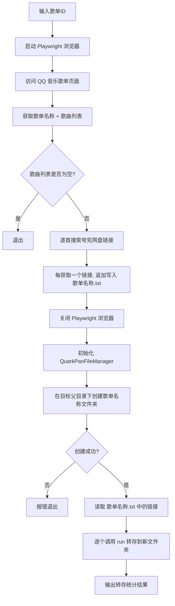

## 用户需求

创建一个新的自动化脚本，整合 `download_music_links.py` 和 `quark.py` 的功能，实现一键式 QQ 音乐歌单转存到夸克网盘的完整流程。

## 产品概述

用户只需输入一个 QQ 音乐歌单 ID，脚本自动完成以下三步操作：获取歌单信息、搜索网盘链接、转存到夸克网盘指定目录。

## 核心功能

1. **获取歌单信息**：通过 Playwright 访问 QQ 音乐歌单页面，获取歌单名称和全部歌曲列表（歌手 - 歌名）
2. **批量搜索网盘链接**：逐首歌曲在 jywav.com 搜索对应的夸克网盘分享链接，每获取到一个链接实时追加写入 `{歌单名称}.txt` 文件，避免中途失败丢失数据
3. **夸克网盘转存**：在父目录 `735eab3ae73849d8b3032fbcd07b1879` 下以歌单名称创建新文件夹，然后将所有获取到的网盘链接批量转存到该新文件夹中
4. **结果汇总**：流程结束后输出转存统计（成功/失败数量），同时保存 CSV 格式的详细结果

## 技术栈

- 语言：Python 3.10+
- 浏览器自动化：Playwright (async API) - 用于获取 QQ 音乐歌单和搜索网盘链接
- HTTP 客户端：httpx (async) - 用于夸克网盘 API 操作（复用 `quark.py` 中 `QuarkPanFileManager`）
- 现有依赖：复用 `download_music_links.py` 的歌曲获取/链接搜索逻辑，复用 `quark.py` 的 `QuarkPanFileManager` 类

## 实现方案

### 整体策略

创建一个新脚本 `auto_music_to_quark.py`，通过 **import** 方式复用现有两个文件的核心函数和类，而非复制代码。脚本内编排三个步骤的串联调用逻辑，形成完整的自动化流水线。

### 关键技术决策

1. **复用而非复制**：直接 import `download_music_links` 中的 `get_songs_from_qq_playlist`、`search_and_get_link`、`sanitize_filename` 函数，以及 `quark.py` 中的 `QuarkPanFileManager` 类。这样后续两个文件的优化可以自动传导。

2. **`create_dir` 返回值改造**：当前 `QuarkPanFileManager.create_dir` 方法返回 `None`，新文件夹 fid 通过全局变量 `to_dir_id` 传递，这不利于脚本间调用。需要修改 `create_dir` 方法使其返回新文件夹的 fid（成功时返回 fid 字符串，同名冲突或失败返回 `None`），同时保持对全局变量的赋值以维持向后兼容。

3. **实时追加写入**：每获取到一个链接立即追加写入 `{歌单名称}.txt`，采用 append 模式（`"a"`），而非全部获取后一次性写入。这样即使脚本中途失败，已获取的链接不会丢失。

4. **转存失败容错**：批量转存时，单个链接转存失败不应阻断整个流程。对每个链接的 `run()` 调用进行 try-except 包裹，记录失败项并继续处理后续链接，最终汇总报告。

### 流程架构



### 数据流

1. `get_songs_from_qq_playlist()` --> `(title: str, songs: list[str])`
2. 循环 songs --> `search_and_get_link()` --> 追加写入 `{safe_title}.txt`
3. `QuarkPanFileManager.create_dir(safe_title, pdir_fid=父目录ID)` --> 返回 `new_folder_fid`
4. 读取 txt 文件中的链接列表 --> 循环调用 `QuarkPanFileManager.run(link, new_folder_fid)`

## 实现注意事项

1. **Playwright 生命周期**：Playwright 浏览器仅在步骤 1-2（获取歌曲和搜索链接）期间使用，步骤 3（夸克网盘操作）使用 httpx，两者互不干扰。Playwright 浏览器应在链接搜索完成后立即关闭，释放资源。

2. **`create_dir` 改造的向后兼容**：修改 `create_dir` 返回 fid 的同时，保留对全局变量 `to_dir_id` 的赋值和 config.json 的更新，确保 `quark.py` 的交互式主程序不受影响。

3. **文件名安全**：复用 `sanitize_filename()` 清理歌单名称中的非法字符，用于文件名和夸克网盘文件夹名。

4. **转存间隔**：每次转存操作之间加入 1-2 秒随机延迟，避免请求过快被限流。

5. **`QuarkPanFileManager` 初始化**：使用 `headless=True` 避免弹出浏览器窗口（仅用于获取 cookies），`slow_mo=0` 提升速度。

## 目录结构

```
project-root/
├── quark.py                    # [MODIFY] 修改 create_dir 方法，增加返回值（返回新文件夹 fid）
├── auto_music_to_quark.py      # [NEW] 自动化主脚本，串联 QQ 音乐歌单获取、链接搜索、夸克网盘转存的完整流程
├── download_music_links.py     # [不修改] 保持现有代码，作为模块被 import 使用
├── utils.py                    # [不修改] 辅助函数
├── quark_login.py              # [不修改] 登录模块
└── config/
    ├── cookies.txt             # [不修改] Cookies 存储
    └── config.json             # [不修改] 运行时会被 create_dir 自动更新
```

**文件详细说明：**

- **`quark.py`** [MODIFY]
- 修改范围：仅 `create_dir` 方法（第 167-199 行）
- 修改内容：将返回类型从 `None` 改为 `str | None`，成功时返回 `json_data["data"]["fid"]`，失败时返回 `None`
- 保持全局变量 `to_dir_id` 赋值和 `config.json` 更新逻辑不变

- **`auto_music_to_quark.py`** [NEW]
- 主入口脚本，接受歌单 ID 作为命令行参数
- 导入 `download_music_links` 中的 `get_songs_from_qq_playlist`、`search_and_get_link`、`sanitize_filename`
- 导入 `quark` 中的 `QuarkPanFileManager`
- 实现 `async def auto_pipeline(playlist_id)` 主流程函数，编排三步操作
- 实现实时追加写入链接文件的逻辑
- 实现批量转存并容错的逻辑
- 输出最终统计结果

## 关键代码结构

```python
# auto_music_to_quark.py 核心接口

# 父目录 ID 常量
PARENT_DIR_ID = "735eab3ae73849d8b3032fbcd07b1879"

async def auto_pipeline(playlist_id: str) -> None:
    """
    自动化流水线主函数
    步骤1: Playwright 获取歌单名称和歌曲列表
    步骤2: Playwright 逐首搜索网盘链接，实时追加写入 {歌单名称}.txt
    步骤3: QuarkPanFileManager 创建文件夹 + 批量转存
    """
    ...
```

```python
# quark.py create_dir 改造后的签名
async def create_dir(self, pdir_name='新建文件夹', pdir_fid='0') -> str | None:
    """创建文件夹，成功返回新文件夹 fid，失败返回 None"""
    ...
```